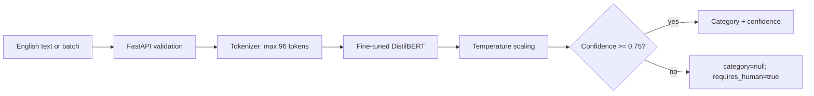

# Support Ticket Classifier

[](https://github.com/mansiks1/support-ticket-classifier/actions/workflows/tests.yml)

Классификация **англоязычных банковских обращений**: 17 классических конфигураций,
DistilBERT, калибровка уверенности, передача оператору и FastAPI. Все числа
получены реальными запусками; test открыт после [фиксации модели](reports/selection.json).

**Итог:** test macro-F1 **0.8819**, accuracy **0.8831**. При пороге 0.75 принято
**80.65%** test-запросов с точностью **95.97%** среди принятых. После исключения
367 близких/точных совпадений с development macro-F1 — **0.8726**.

**Ограничение:** это in-domain benchmark. Вопрос о погоде модель уверенно приняла
за банковское обращение. Нет русского языка, надёжного OOD-детектора, нескольких
намерений или меток приоритета. Это не готовая автономная банковская поддержка.

## Данные и лицензии

[BANKING77 / PolyAI](https://github.com/PolyAI-LDN/task-specific-datasets),
Casanueva et al. (2020), [публикация](https://arxiv.org/abs/2003.04807), **CC BY 4.0**.
77 классов, 10,003 исходных development и 3,080 test примеров. После очистки
development: 9,971. Код MIT; базовые веса DistilBERT Apache-2.0. Лицензия кода
не распространяется на чужие данные. [DATA_CARD](DATA_CARD.md) ·
[MODEL_CARD](MODEL_CARD.md) · [Атрибуция весов](models/THIRD_PARTY.md).

## Результаты и выбор

| Метод | Validation macro-F1 | Fit, с | Артефакт, МБ |
|---|---:|---:|---:|
| Dummy | 0.0005 | 0.17 | 0.08 |
| TF-IDF + Logistic Regression, C=1 | 0.8097 | 3.65 | 4.20 |
| TF-IDF + Linear SVM, C=0.5 | 0.8519 | 0.56 | 1.89 |
| TF-IDF + ComplementNB, alpha=1 | 0.7250 | 0.19 | 4.42 |
| DistilBERT, 2 эпохи | **0.8681** | 80.90 | 269.01 |

Классика: один CPU-поток, DistilBERT: RTX 4050. Полные параметры, инференс,
память и восемь абляций: [таблица](reports/experiments.csv),
[Transformer](reports/transformer.json), [CPU serving](reports/cpu-serving.json).
Итоговый CPU-инференс: медиана 28.86 мс на одиночный запрос в данном окружении.

Обе выбранные модели — **DistilBERT**. Заранее заданное правило выбирало
наименьший артефакт в пределах 0.01 macro-F1 от лучшего. SVM отстал на 0.0162
и не прошёл допуск; он остаётся компактной альтернативой при другом продуктовом
ограничении. Удаление стоп-слов ухудшило LR; удаление пунктуации не помогло.


## Архитектура



`src/` — данные, обучение и inference; `notebooks/` — выполненное исследование;
`api/` — HTTP; `tests/` — 41 тест; `reports/` — результаты; `article/` — статья.

## Быстрый запуск с опубликованными весами

Python **3.12** (проверено 3.12.14); для API достаточно CPU. Из корня репозитория:

```bash
git clone https://github.com/mansiks1/support-ticket-classifier.git
cd support-ticket-classifier
python -m venv .venv
# Linux/macOS:
source .venv/bin/activate
# Windows PowerShell вместо предыдущей строки:
# .venv\Scripts\Activate.ps1
python -m pip install -r requirements-dev.lock
python -m pip install --no-deps -e .
python -m pip install torch==2.8.0 --index-url https://download.pytorch.org/whl/cpu
python -m pip install -r requirements-transformer.lock
python scripts/download_model.py
python -m uvicorn api.main:app --host 127.0.0.1 --port 8000
```

Загрузчик берёт bundle из [Release v1.0.0](https://github.com/mansiks1/support-ticket-classifier/releases/tag/v1.0.0)
и проверяет [SHA-256](MODEL_BUNDLE.sha256) до распаковки. Данные и веса не лежат
в Git. Joblib следует загружать только из доверенного источника.

В отдельном терминале:

```bash
curl http://localhost:8000/health
curl http://localhost:8000/model-info
curl -X POST http://localhost:8000/predict -H 'Content-Type: application/json' -d '{"text":"My card has not arrived yet"}'
curl -X POST http://localhost:8000/predict -H 'Content-Type: application/json' -d '{"text":["My card has not arrived yet","card"]}'
```

В PowerShell используйте `curl.exe` или:

```powershell
Invoke-RestMethod http://localhost:8000/predict -Method Post -ContentType 'application/json' -Body '{"text":"My card has not arrived yet"}'
```

Фактически полученный ответ (округлён):

```json
{"predictions":[{"category":"card_arrival","suggested_category":"card_arrival","confidence":0.882341,"priority":null,"requires_human":false}]}
```

При отказе `category=null`, `requires_human=true`, предполагаемый класс остаётся
в `suggested_category`. Приоритета в данных нет, поэтому `priority=null`.
Пустые строки, неверные типы, текст длиннее 4000 символов и пакет больше 64 дают
422; отсутствие модели — 503. Unicode не вызывает падения, но это не означает
поддержку всех языков. OpenAPI: `/docs`. Проверка живого сервера:

```bash
python scripts/verify_api.py --url http://127.0.0.1:8000
```

## Данные и воспроизведение

Upstream commit и SHA-256 зафиксированы. Подготовка:

```bash
python -m src.data prepare
python -m src.data split
python -m src.eda
```

Для нового полного исследования создайте отдельную копию без сохранённых
результатов. Скрипт не изменяет опубликованные доказательства:

```bash
python scripts/fresh_research.py ../support-ticket-reproduction
cd ../support-ticket-reproduction
# Оставьте активным окружение с установленными зависимостями.
python scripts/reproduce.py
```

Для GPU установите PyTorch 2.8.0 из индекса `https://download.pytorch.org/whl/cu128`
вместо CPU wheel. Без GPU полный скрипт обучает Transformer на CPU существенно
дольше. Команды внутри: `src.data prepare`, `src.data split`, `src.train baseline`,
`src.train classical`, загрузка WordNet, `src.train ablation`,
`src.transformer_experiment`, `src.calibrate`, `src.analyse`, `src.evaluate`.
Seed 2026; все предиктивные преобразования учатся только на fit.

Проверка замороженных результатов в исходном репозитории после загрузки весов
и подготовки данных:

```bash
python -m src.evaluate --verify
```

GPU/CPU и BLAS/CUDA могут давать численные расхождения. Проверка допускает 1e-6
для вещественных метрик, сохраняя точное сравнение хешей и счётчиков;
на исходном окружении получено и точное совпадение. Повторное обучение не обязано
побитово воспроизвести веса. Test не участвует в выборе; загрузка test разрешена
только после `reports/selection.json`. Протокол: [PROTOCOL.md](PROTOCOL.md).

Для отдельной lemmatisation: `python -m nltk.downloader wordnet`; полный скрипт
сам задаёт локальный `NLTK_DATA`. Итоговый inference от WordNet не зависит.
Notebook: `python scripts/notebooks.py`; отчёты: `python scripts/build_reports.py`.

## Тесты и Docker

```bash
python -m pytest -q
ruff check .
ruff format --check .
docker build --build-arg WITH_TRANSFORMER=1 -t support-ticket-classifier .
docker run --rm -p 8000:8000 -v "${PWD}/models:/app/models:ro" support-ticket-classifier
```

В PowerShell для volume также можно использовать
`--mount "type=bind,source=$((Get-Location).Path)\models,target=/app/models,readonly"`.
Контейнер работает на CPU от непривилегированного пользователя; модель доступна
только для чтения. Без `WITH_TRANSFORMER=1` образ предназначен для классических
моделей и синтетического CI fixture, а не DistilBERT.

CI не обучает Transformer: проверяет lint, 41 тест и HTTP в контейнере на
синтетическом fixture. Фактические проверки итоговых весов и контейнера:
[verification.json](reports/verification.json).

## Материалы

- [Технический отчёт](reports/technical-report.md): эксперименты, калибровка, стоимость и угрозы валидности.
- [Статья](article/article.md): решения и выводы для широкой аудитории.
- [Разбор ошибок](reports/error-analysis.md): 10 правильных, 20 ошибочных и неуверенные примеры.
- [EDA](notebooks/01_eda.ipynb) и [experiments](notebooks/02_experiments.ipynb): выполненные notebook.
- [Формулировки для резюме](reports/resume.md).

## Почему проект подходит для резюме

Проект демонстрирует постановку прикладной ML-задачи, работу с несовершенными
данными и дисбалансом, baseline, честные train/calibration/validation/test,
предотвращение утечки, сравнение семейств моделей, выбор метрик, анализ ошибок
и ограничений, калибровку, сравнение качества со стоимостью, воспроизводимость,
превращение notebook в модуль, тесты, API, контейнеризацию, техническое письмо
и объяснение результата нетехническому читателю.

Дальше: OOD-данные, несколько seeds, временной holdout, семантические дубликаты,
мультиязычность и реальные бизнес-стоимости ошибок. Не заявляются производственная
нагрузка, SLA или опыт эксплуатации в банке.
