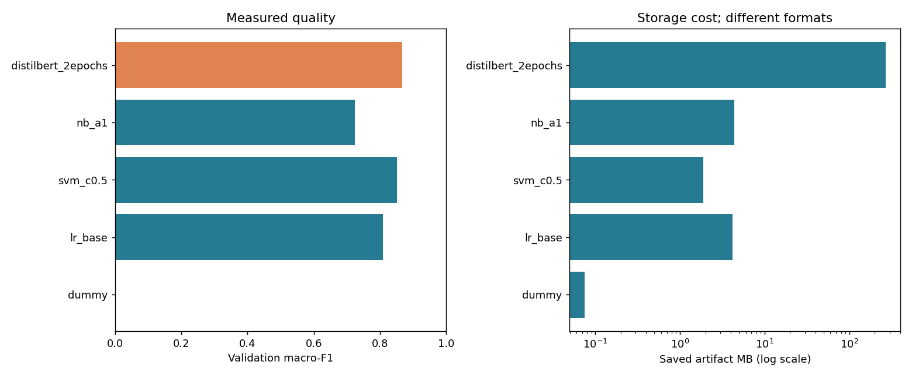

# Стоят ли 1,6 пункта F1 нейросети: эксперимент с обращениями в поддержку

Представьте очередь банковской поддержки. Одно сообщение сообщает о задержке
карты, другое — о чужом платеже. Автоматическая сортировка может помочь, но
ошибочное уверенное решение способно отправить человека не к тому специалисту.
Поэтому я исследовал не только правильность категории, но и право модели отказаться.

## Сначала договоримся о честном эксперименте

Я взял открытый английский BANKING77: 77 намерений, от активации карты до
проблем с переводом. Источник — PolyAI и Casanueva et al. (2020), лицензия CC BY 4.0.
Это учебный benchmark, не выгрузка моего банка. Русские обращения и приоритеты
этот проект не моделирует: соответствующих меток нет.

Даже здесь данные не оказались идеально чистыми. Точное сравнение не нашло
повторов, а нормализация нашла 30 дубликатов и две конфликтующие строки.
После очистки я оставил отдельные части для обучения, калибровки и выбора модели,
удержав близкие дубликаты вместе. Официальный test оставался закрыт до выбора.
Так оценка не превращается в соревнование по запоминанию отложенной выборки.

## Простое решение уже полезно

Dummy, всегда выбирающий частую метку, дал macro-F1 0.0005. TF-IDF и Logistic
Regression дали 0.8097. Но первое улучшение пришло
не от нейросети: Linear SVM достиг 0.8519, обучаясь
за 0.56 секунды на одном CPU-потоке.

Я проверил восемь привычных способов предобработки по одному. Удаление стоп-слов
ухудшило результат. Удаление пунктуации ничего не изменило: стандартный tokenizer
уже её отбрасывал. Даже добавление word bigrams оказалось не гарантированным
улучшением — unigrams выиграли у исходной конфигурации. Такие результаты полезнее
списка «обязательных» шагов очистки: каждый шаг должен оправдать себя измерением.

## Нейросеть всё же выиграла — вопрос в цене

DistilBERT обучался две эпохи на RTX 4050. Validation macro-F1 стал
0.8681: +1.62
процентного пункта к SVM. Обучение заняло 80.9 секунды,
а артефакт вырос примерно с 1.89 до 269.0 МБ.
Кроме весов появились torch, tokenizer и ограничения длины. GPU latency и CPU
latency измерены на разных устройствах; выдавать их за чистое аппаратно равное
сравнение было бы нечестно.

Моё заранее записанное правило разрешало потерять максимум 0.01 macro-F1 ради
меньшего размера. SVM не уложился в этот допуск, поэтому итоговым стал DistilBERT.
Если продукт допускает потерю около 0.016, выбор может быть другим. Нельзя сначала
увидеть результат, а потом подобрать критерий так, чтобы победил любимый алгоритм.



## Уверенность — тоже гипотеза

На отдельной calibration-части я подобрал температуру вероятностей. Она не меняет
победивший класс, но меняет силу уверенности. ECE на validation уменьшилась с
0.0854 до 0.0177. Затем выбрал порог 0.75,
при котором точность принятых validation-решений достигала хотя бы 95%.

Когда все решения были зафиксированы, test дал macro-F1 **0.8819**.
Система приняла **80.65%** запросов с точностью **95.97%**,
остальные 596 из 3080 передала человеку. Это измеренная точность
внутри benchmark, не обещание качества на любом входе.

Проверка пересечений обнаружила ещё одну неприятную деталь: у 367
test-текстов есть близкие или точные совпадения с development. На оставшихся
2713 примерах macro-F1 снизился до 0.8726.
Поэтому рядом с красивым официальным числом необходимо публиковать и этот результат.

## Где сервис ошибается

«Where is my card?» не объясняет, была ли карта заказана или потеряна.
«Why can't I make a transfer?» не говорит причину отказа, но модель уверенно
предположила проблему с получателем. Сообщение о взломанном аккаунте и чужом платеже
действительно подходит нескольким категориям, хотя benchmark требует одну.

Самый показательный провал — вопрос о погоде. Модель приняла его за вопрос о
сроках доставки карты с confidence 0.8913. Значит, temperature scaling и порог
не заменяют обнаружение неизвестных тем. Это ограничение я сохранил в отчёте,
вместо того чтобы добавить правило специально под один уже увиденный пример.

## Из notebook в API

Исследовательская логика находится в Python-модулях. Notebook лишь показывает
проверенные данные, таблицы и выводы. FastAPI принимает один текст или список;
при отказе `category` равна null, а `suggested_category` остаётся подсказкой
оператору. Поле `priority` также null: модель не должна изобретать отсутствующие метки.

```bash
curl -X POST http://localhost:8000/predict -H 'Content-Type: application/json' \
  -d '{"text":"My card has not arrived yet"}'
```

Тесты проверяют не только метрики, но и путь от обучения маленькой модели до
HTTP-ответа, загрузку артефактов, ошибочные типы, пустые строки и Unicode.
Для развёртывания есть Docker, а для повторения — версии зависимостей, исходных
данных, seed и полный журнал экспериментов.

## Практический вывод

В этом эксперименте усложнение до SVM дало особенно выгодный шаг. DistilBERT
добавил качество, но потребовал заметно больше памяти и инфраструктуры. Часть
обычной предобработки оказалась бесполезной или вредной. Ценность проекта —
в измеренном выборе с открытыми ограничениями, а не в обязательной победе
самого простого или самого сложного подхода.

[Код и инструкции](https://github.com/mansiks1/support-ticket-classifier) ·
[Полный технический отчёт](../reports/technical-report.md) ·
[Примеры ошибок](../reports/error-analysis.md).
