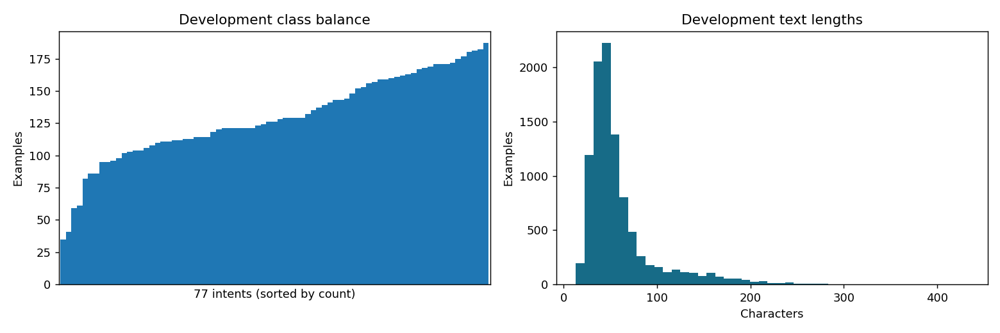
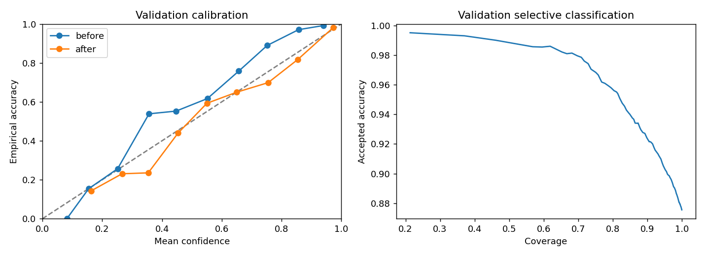
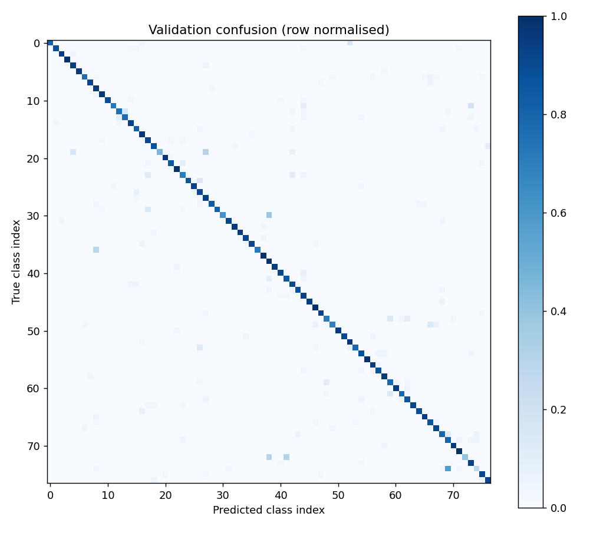

# Классификация обращений: качество и цена усложнения

## Аннотация

На BANKING77 выполнены 17 классических конфигураций и один двухэпоховый
DistilBERT. Исследовательская и практическая модели совпали: `distilbert_2epochs`.
Official test macro-F1 — **0.8819**, после исключения близких
совпадений с development — **0.8726**. Это benchmark для
англоязычных банковских запросов, а не доказательство готовности к автономной работе.

## Постановка задачи

Пользователь системы — команда поддержки, маршрутизирующая обращения. Вход —
один английский текст или пакет до 64 текстов. Выход — категория (null при отказе),
предполагаемая категория, confidence, requires_human и priority=null. Меток
приоритета в данных нет. Неверная маршрутизация может задержать разбор потери
карты или спорного платежа. Потенциальная польза — сокращение ручной сортировки;
экономия времени операторов в реальном сервисе не измерялась.

## Данные, лицензия и очистка

Источник: [PolyAI](https://github.com/PolyAI-LDN/task-specific-datasets), BANKING77,
Casanueva et al., *Efficient Intent Detection with Dual Sentence Encoders*, 2020,
[публикация](https://arxiv.org/abs/2003.04807). Данные CC BY 4.0; собственный код MIT;
базовые веса DistilBERT Apache-2.0. Зафиксированы upstream revision и SHA-256.
Поля — text и category, 77 классов. Приватные данные не использованы.

Из 10003 development-строк удалено 2
строки с конфликтующими нормализованными текстами и 30
последующих повторов. Осталось 9971. Невалидных строк и null-ячеек:
0 и 0. Точное сравнение исходных текстов
не находило повторов: они проявились после NFKC, casefold и нормализации пунктуации.
Проверка email и длинных цифровых последовательностей дала ноль срабатываний;
это ограниченный экран, не полная гарантия отсутствия чувствительной информации.
Публикуются только небольшие вручную просмотренные примеры с атрибуцией.

Число объектов в классе: от 35 до 187.
Все классы и количества: [data-audit.json](data-audit.json). Медиана длины —
47 символов, 95-й процентиль —
151.5, максимум — 433.

## Протокол и защита от утечки

Протокол опубликован до обучения: [PROTOCOL.md](../PROTOCOL.md). Seed=2026.
Компоненты близких дубликатов построены по char_wb 3–5 cosine ≥0.92:
325 нетривиальных компонент, 515
пар. StratifiedGroupKFold удерживает компоненты внутри частей. Получено 5992 fit,
1996 calibration и 1983 validation, во всех частях есть 77 классов. Пересечения
групп и нормализованных текстов проверены. Предиктивный TF-IDF обучался только
на fit; представление для поиска дубликатов не использовалось как признак модели.
При отсутствии user/dialogue/time ID проверить временную и пользовательскую
утечку нельзя. В признаки не попадают category, индекс строки и служебные поля.

Validation использован для ограниченного поиска и инженерного выбора; calibration
— только для температуры. Выбор, веса и порог хешированы и опубликованы до
загрузки test. После открытия test обучение и порог не менялись. Повторная команда
`evaluate --verify` проверяет воспроизводимость замороженных результатов, а не
выбирает решение. Все split hashes: [splits.json](splits.json).

## Эксперименты и метрики

Dummy предсказывает частый класс. Далее TF-IDF + Logistic Regression, Linear SVM,
ComplementNB и DistilBERT. Основная метрика macro-F1 одинаково учитывает каждый
класс. Accuracy может скрывать слабые редкие классы; weighted-F1 дополняет, но
не заменяет macro-F1. Top-2 полезен как список подсказок оператору. Macro AP —
one-vs-rest average precision, не трапецеидальная площадь под PR-кривой; ROC-AUC
не нужен как дублирующая метрика. Precision/recall и confusion сохранены для каждого класса.

Поиск: SVM C ∈ {0.5,1,2}, LR C ∈ {0.5,1,2}, NB alpha ∈ {0.1,1}.
Восемь однофакторных LR-абляций: регистр, пунктуация, стоп-слова, WordNet noun
lemmatisation, word unigrams, char_wb 3–5, словарь 5000 и balanced weights.
Все сравнения используют одинаковые части. Взаимодействия факторов не исследованы.
Встроенный word-tokenizer уже отбрасывает пунктуацию — потому явное удаление
пунктуации здесь не дало выигрыша. WordNet используется без POS tagging.

| Метод | Validation macro-F1 | Δ к LR | Обучение, с | Один запрос, мс | Batch, мс/текст | Размер, МБ | Поддержка | Вывод |
| --- | --- | --- | --- | --- | --- | --- | --- | --- |
| dummy | 0.0005 | -0.8093 | 0.170 | 1.349 | 0.026 | 0.075 | sklearn + vocabulary | Нулевая точка |
| lr_base | 0.8097 | +0.0000 | 3.655 | 3.143 | 0.029 | 4.200 | sklearn + vocabulary | Не выбран |
| svm_c0.5 | 0.8519 | +0.0422 | 0.557 | 1.031 | 0.026 | 1.892 | sklearn + vocabulary | Компактная альтернатива |
| svm_c1 | 0.8500 | +0.0403 | 0.612 | 0.976 | 0.027 | 1.655 | sklearn + vocabulary | Не выбран |
| svm_c2 | 0.8515 | +0.0418 | 0.684 | 1.018 | 0.027 | 1.505 | sklearn + vocabulary | Не выбран |
| nb_a0.1 | 0.7122 | -0.0975 | 0.207 | 2.833 | 0.031 | 4.453 | sklearn + vocabulary | Не выбран |
| nb_a1 | 0.7250 | -0.0848 | 0.194 | 2.733 | 0.029 | 4.420 | sklearn + vocabulary | Не выбран |
| lr_c0.5 | 0.7512 | -0.0585 | 2.511 | 2.900 | 0.029 | 4.199 | sklearn + vocabulary | Не выбран |
| lr_c2 | 0.8347 | +0.0250 | 4.199 | 2.799 | 0.029 | 4.201 | sklearn + vocabulary | Не выбран |
| lr_case | 0.8041 | -0.0056 | 3.833 | 2.923 | 0.030 | 4.375 | sklearn + vocabulary | Не выбран |
| lr_punct | 0.8097 | +0.0000 | 3.668 | 2.785 | 0.032 | 4.200 | sklearn + vocabulary | Не выбран |
| lr_stop | 0.7794 | -0.0303 | 2.046 | 1.935 | 0.022 | 2.278 | sklearn + vocabulary | Не выбран |
| lr_lemma | 0.8206 | +0.0109 | 7.509 | 2.933 | 0.091 | 4.100 | sklearn + WordNet | Не выбран |
| lr_unigram | 0.8294 | +0.0197 | 1.018 | 1.299 | 0.018 | 0.725 | sklearn + vocabulary | Не выбран |
| lr_char | 0.8403 | +0.0306 | 6.454 | 3.875 | 0.104 | 4.473 | sklearn + vocabulary | Не выбран |
| lr_vocab | 0.8063 | -0.0034 | 2.747 | 2.202 | 0.029 | 2.950 | sklearn + vocabulary | Не выбран |
| lr_balanced | 0.8183 | +0.0086 | 2.726 | 2.836 | 0.030 | 4.200 | sklearn + vocabulary | Не выбран |
| distilbert_2epochs | 0.8681 | +0.0584 | 80.898 | 8.265 | 0.738 | 269.014 | torch + tokenizer + weights | Выбран по протоколу |

Classical timings: CPU, один поток, измерение fit без загрузки пакетов и данных.
Latency включает преобразование текста и предсказание; медиана пяти прогретых
измерений. Размер — сжатый joblib для классики и каталог сохранённых весов с
токенизатором для Transformer, поэтому форматы различаются. Dummy также содержит
TF-IDF для единого интерфейса; его стоимость не минимально возможная.
RSS — память всего процесса, не изолированный пик; поля есть в experiments.json.
Обучение Transformer: RTX 4050, две эпохи, AdamW 5e-5, batch 16, max_length 96;
GPU peak allocated 1301.1 MiB. GPU и CPU latency нельзя
трактовать как сравнение на одном устройстве. Версии: [environment.json](environment.json),
PyTorch 2.8.0+cu128; CPU Intel64 Family 6 Model 183 Stepping 1, GenuineIntel, RAM 23.7 GiB.
Скачивание 3.2 GiB CUDA runtime и весов не включено во время обучения.
Дополнительный CPU serving benchmark: медиана одиночного запроса 28.86 мс,
batch=32 — 37.29 мс на текст; cold load и первый запрос — 62.32 с, RSS 806.97 MiB.
Это отдельный прогретый замер, а не нагрузочный тест; см. cpu-serving.json.
JSON/CSV с параметрами, версиями и хешами служат лёгким журналом экспериментов;
MLflow не добавлялся ради малого числа запусков.

## Какие усложнения оправдались

LR существенно превосходит Dummy и задаёт рабочую отправную точку. SVM улучшает
LR на 0.0422 macro-F1,
обучается быстрее в этом эксперименте и хранится компактнее. Для поддержки оба
требуют лишь sklearn и словарь; линейные коэффициенты доступны для анализа.
ComplementNB дешевле учится, но уступает по качеству, поэтому не выбран.
Лемматизация увеличила время и зависимости ради умеренного выигрыша; stop words
ухудшили качество. Символьная модель помогает относительно базового LR, но
уступает SVM и крупнее. Балансировка дала умеренный прирост, а ограничение словаря
сократило размер с небольшой потерей качества. Простые unigrams оказались лучше
базовых bigrams: усложнение признаков не автоматически полезно.

DistilBERT дал +0.0162
macro-F1 к лучшему SVM, но весит в 142.2
раза больше; его fit занял в 145.3
раза больше времени даже с GPU. Поддержка сложнее: torch, transformers, tokenizer,
веса и ограничения длины. Коэффициенты заменены приближённым анализом чувствительности.
Правило практического выбора: минимальный размер среди моделей в пределах 0.01
от лучшего macro-F1. В этот допуск SVM не попал, поэтому оба победителя — DistilBERT.
Это явное ограничение на допустимую потерю качества, а не универсальный бизнес-оптимум.
Если сервис допускает потерю 0.0162 macro-F1 на validation ради компактности,
SVM остаётся разумным альтернативным решением. Эксперимент не доказывает, что
Transformer всегда лучше или всегда неоправдан.

## Калибровка и передача оператору

SVM decision_function не является вероятностью. Raw softmax служил только
нормированным score для сравнения ранжирования. Для выбранного DistilBERT
температура 0.765544 обучена минимизацией calibration NLL;
она сохранена, потому что validation NLL улучшился. Top-1 решения не меняются.

| Состояние | NLL | Brier (сумма по классам) | ECE (10 bins) |
| --- | --- | --- | --- |
| before | 0.4893 | 0.1916 | 0.0854 |
| after | 0.4325 | 0.1821 | 0.0177 |

| Порог | Принято | Coverage | Accuracy принятых | Оператору |
| --- | --- | --- | --- | --- |
| 0.0 | 1983 | 1.000 | 0.875 | 0 |
| 0.5 | 1863 | 0.939 | 0.910 | 120 |
| 0.7 | 1685 | 0.850 | 0.940 | 298 |
| 0.75 | 1627 | 0.820 | 0.951 | 356 |
| 0.8 | 1559 | 0.786 | 0.960 | 424 |
| 0.9 | 1352 | 0.682 | 0.982 | 631 |
| 0.95 | 1127 | 0.568 | 0.986 | 856 |
| 0.99 | 423 | 0.213 | 0.995 | 1560 |

Порог 0.75 выбран как максимальное покрытие при
validation accepted accuracy ≥0.95 и хотя бы 100 принятых примерах. Это точность
среди принятых, не per-class precision и не SLA. На test принято 2484
из 3080 (80.65%), оператору передано 596;
accepted accuracy 95.97%, Wilson 95% интервал
[95.13%; 96.68%].
Интервал предполагает независимость наблюдений; близкие формулировки ограничивают её.

## Единственная финальная test-оценка

| Выборка | Accuracy | Macro-F1 | Weighted-F1 | Top-2 | Macro AP |
| --- | --- | --- | --- | --- | --- |
| Validation (до калибровки) | 0.8754 | 0.8681 | 0.8746 | 0.9435 | 0.9465 |
| Official test | 0.8831 | 0.8819 | 0.8819 | 0.9471 | 0.9458 |
| Test без близких совпадений | 0.8747 | 0.8726 | 0.8740 | 0.9414 | 0.9397 |

Из 3080 официальных примеров 25 совпали
с development после нормализации; всего 367 имели
точное/близкое совпадение. Заранее предусмотренный sensitivity-анализ оставил
2713 примеров. Их macro-F1 ниже. Это важная угроза
валидности исходного benchmark; порог 0.92 не обнаруживает все парафразы, а удаление
меняет распределение выборки. На test не сравнивались все 18 конфигураций:
оценён только замороженный финальный выбор. Полный поиск сравнивается по validation.

Хуже всего по test F1:

| Класс | Precision | Recall | F1 | Support |
| --- | --- | --- | --- | --- |
| why_verify_identity | 0.812 | 0.325 | 0.464 | 40 |
| get_disposable_virtual_card | 0.552 | 0.925 | 0.692 | 40 |
| disposable_card_limits | 0.920 | 0.575 | 0.708 | 40 |
| virtual_card_not_working | 1.000 | 0.550 | 0.710 | 40 |
| card_swallowed | 1.000 | 0.575 | 0.730 | 40 |
| verify_my_identity | 0.615 | 1.000 | 0.762 | 40 |
| supported_cards_and_currencies | 0.649 | 0.925 | 0.763 | 40 |
| balance_not_updated_after_bank_transfer | 0.806 | 0.725 | 0.763 | 40 |
| card_acceptance | 0.931 | 0.675 | 0.783 | 40 |
| transfer_timing | 0.750 | 0.825 | 0.786 | 40 |

Полные precision/recall: [test-per-class.json](test-per-class.json),
[confusion](test-confusion.csv). Слабые классы приведены описательно, без изменения модели.

## Ошибки, интерпретация и устойчивость

[Отдельный разбор](error-analysis.md): 10 правильных, 20 ошибочных, 10 неуверенных
примеров; смешанные намерения, недостаток контекста и гипотезы о разметке.
[Топ-признаки SVM](top-features.json) для всех классов; [удаление слов](occlusion.json)
для Transformer — только локальная чувствительность, не причинное объяснение.

Регистр и лишние пробелы устойчивы на проверенном validation; искусственная
опечатка снизила macro-F1 до 0.8013. Пустой/слишком длинный ввод отклоняется.
Модель не умеет надёжно обнаруживать OOD: вопрос о погоде принят с confidence
0.8913. Русский и смешанный ввод не поддерживаются, несмотря на отсутствие падения.
Тексты ограничены 4000 символами, но модель видит лишь первые 96 токенов.

## Реализация, проверки и угрозы валидности

Исследование отделено от src и api. FastAPI: /health, /predict, /model-info,
строгая проверка типов, размер пакета 1–64. Отказ возвращает category=null и
сохраняет suggested_category как подсказку. Тексты не сохраняются в логах.
41 тест включает unit, train smoke, roundtrip, reproducibility и полный путь
обучение → сохранение → загрузка → HTTP через TestClient. CI также собирает
Docker и проверяет HTTP в контейнере на явно синтетическом fixture.
Фактические проверки итоговых весов и контейнера записываются в [verification.json](verification.json).

Ограничения: один seed, один ограниченный neural run, выбранные гиперпараметры,
selection bias от нескольких validation-сравнений, отсутствие внешнего банка,
неизвестных тем, временных/user ID и приоритетов. Статистическая значимость малых
различий не установлена. Нет нагрузочного теста, аутентификации, rate limiting
или проверки реальных бизнес-потерь; это воспроизводимый портфельный сервис.

Дальше: отдельный OOD-набор и правила эскалации, несколько seeds, группировка
семантических парафразов, real-world temporal holdout, multilingual/multilabel,
CPU-оптимизация и измерение стоимости ошибок совместно с поддержкой.

## Воспроизведение

Команды установки, загрузки release-артефактов, полного исследования в отдельной
копии, проверки frozen metrics, API и Docker: [README](../README.md).
Числа и графики этого отчёта генерируются `python scripts/build_reports.py` из
сохранённых результатов. Ручная интерпретация ошибок вынесена в отдельный файл.
